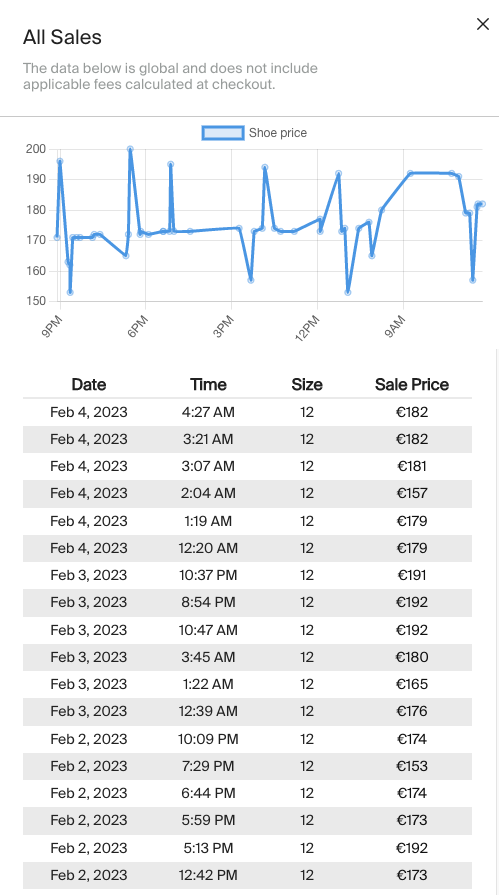

# hypebeast-buddy

A browser extension for an easier resselling experience on [Stockx](https://stockx.com/) website.

This tool uses [Chart.js](https://www.chartjs.org/) to insert a graph using of the latest sales for the shoe on top of the table with sales data.  
It serves user for an easier understanding of the short-term shoe price trend.

Extension also clears cookie that tracks number of continuous website visits.
